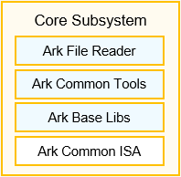

# Runtime Core<a name="EN-US_TOPIC_0000001138850082"></a>

- [Runtime Core<a name="EN-US_TOPIC_0000001138850082"></a>](#runtime-core)
  - [Introduction<a name="section11660541593"></a>](#introduction)
  - [Directory Structure<a name="section161941989596"></a>](#directory-structure)
  - [Building](#building)
  - [Guidelines](#guidelines)
    - [Usage Guidelines<a name="section1312121216216"></a>](#usage-guidelines)
      - [Assembler ark\_asm](#assembler-ark_asm)
      - [Disassembler ark\_disasm](#disassembler-ark_disasm)
  - [Repositories Involved<a name="section1371113476307"></a>](#repositories-involved)

## Introduction<a name="section11660541593"></a>

As a common module of language runtime in OpenHarmony, ArkCompiler Runtime Core consists of language-independent basic runtime libraries, including ArkCompiler File, Tooling, Base and ISA. ArkCompiler File provides bytecodes and information required for executing bytecodes. Tooling supports runtime debugger. Base is responsible for implementing platform related utilities. ISA provides common instruction set architecture that is language-independent.

**Figure 1** ArkCompiler Runtime Core architecture diagram：



For more information, see: [ARK Runtime Subsystem](https://gitee.com/openharmony/docs/blob/master/en/readme/ARK-Runtime-Subsystem.md).

## Directory Structure<a name="section161941989596"></a>

```
├── assembler               # Assembler that converts an ARK bytecode file in text format (*.pa) into a bytecode file in binary format (*.abc). For details about the format, see docs/assembly_format.md and docs/file_format.md.
├── bytecode_optimizer      # Bytecode optimizer, further optimize the ARK bytecode to generate optimized bytecode file in binary format (*.abc).
├── cmake                   # Cmake script that contains the toolchain files and common cmake functions used to define the build and test targets.
├── compiler                # Compiler including IR(intermediate representation) and passes for bytecode optimization. See docs/ir_format.md.
├── cross_values            # Cross values generator.
├── disassembler            # Disassembler that converts an ARK bytecode file in binary format (*.abc) into an ARK bytecode file in text format (*.pa).
├── docs                    # Language frontend, ARK file format, and runtime design documents.
├── dprof                   # Data used to collect the profiling data for ARK runtime.
├── gn                      # GN templates and configuration files.
├── irtoc                   # IR to code tool, aims to compile a manually created IR to the target code.
├── isa                     # Bytecode ISA description file YAML, Ruby scripts and templates.
├── ldscripts               # Linker scripts used to place ELF sections larger than 4 GB in a non-PIE executable file.
├── libark_defect_scan_aux  # Vulnerability defect scanning tool for ARK bytecode file in binary format (*.abc).
├── libpandabase            # Basic ArkCompiler runtime library, including logs, synchronization primitives, and common data structure.
├── libpandafile            # Source code repository of ARK bytecode files (*.abc) in binary format.
├── libziparchive           # Provides APIs for reading and using zip files implemented by zlib.
├── panda                   # CLI tool used to execute ARK bytecode files in binary format(*.abc).
├── pandastdlib             # Standard libraries wrote by the ARK assembler.
├── platforms               # Platform related utilities.
├── plugins                 # Language-dependent plugins.
├── quickener               # Quickener tool.
├── runtime                 # ARK runtime command module.
├── scripts                 # CI Scripts.
├── templates               # Ruby templates and scripts used to process command line options, loggers, error messages, and events.
├── tests                   # Test cases.
└── verification            # Bytecode verifier. See docs/bc_verification.
```

## Building

**Linux platform**
```
$ ./build.sh --product-name hispark_taurus_standard --build-target ark_host_linux_tools_packages
```
**Windows platform**
```
$ ./build.sh --product-name hispark_taurus_standard --build-target ark_host_windows_tools_packages
```
**Mac platform**
```
$ ./build.sh --product-name hispark_taurus_standard --build-target ark_host_mac_tools_packages
```

## Guidelines

### Usage Guidelines<a name="section1312121216216"></a>

#### Assembler ark\_asm

The ark\_asm assembler converts the text ARK bytecode file into a bytecode file in binary format.

Command:

```
ark_asm [Options] Input file Output file
```

Supported options:

| Option        | Description                                                                                  |
|---------------|----------------------------------------------------------------------------------------------|
| --dump-scopes | Save the result to a JSON file to support the debug mode in Visual Studio Code.              |
| --help        | Display help information.                                                                    |
| --log-file    | Specify the log file output path after log printing is enabled.                              |
| --optimize    | Enable compilation optimization.                                                             |
| --size-stat   | Collect statistics and print ARK bytecode information after conversion.                      |
| --verbose     | Enable log printing.                                                                         |
| --version     | Print version info, including file format version and minimum supported file format version. |

Input file: ARK bytecodes in text format

Output file: ARK bytecodes in binary format

#### Disassembler ark\_disasm

The ark\_disasm disassembler converts binary ARK bytecodes into readable text ARK bytecodes.

Command:

```
ark_disasm [Options] Input file Output file
```

Supported options:

| Option                 | Description                                                                                  |
|------------------------|----------------------------------------------------------------------------------------------|
| --debug                | Enable the function for printing debug information.                                          |
| --debug-file           | Specify the path of the debug information output file. The default is `std::cout`.           |
| --help                 | Display help information.                                                                    |
| --quiet                | Enable all of the "--skip-\*" flags.                                                         |
| --skip-string-literals | Replace string literals with their respective id's, thus shortening emitted code size.       |
| --verbose              | Enable log printing.                                                                         |
| --version              | Print version info, including file format version and minimum supported file format version. |

Input file: ARK bytecodes in binary format

Output file: ARK bytecodes in text format


For more information, please see: [ARK Runtime Usage Guide](https://gitee.com/openharmony/arkcompiler_ets_runtime/blob/master/docs/ARK-Runtime-Usage-Guide.md).

## Repositories Involved<a name="section1371113476307"></a>

**[arkcompiler\_runtime\_core](https://gitee.com/openharmony/ark_runtime_core)**

[arkcompiler\_ets\_runtime](https://gitee.com/openharmony/arkcompiler_ets_runtime)

[arkcompiler\_ets\_frontend](https://gitee.com/openharmony/arkcompiler_ets_frontend)
