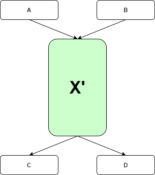

# Cleanup optimization pass
## Overview

`Cleanup` pass works like dead code elimination (DCE) and removes code which does not affect the program results.
It also removes empty basic blocks when it is possible and merges a linear basic block sequence to one bigger basic block,
thus simplifying control flow graph.

Picture of merging a linear basic block sequence:

**Before:**


**After:**



## Rationality

Removing dead code reduces the number of instructions. Merging linear path of blocks in one big block gives an opportunity for more optimizations, because **data locality** is improved.

After any optimization which deletes instructions some basic blocks may become empty or may contain only Phi instructions.
In order not to bother about processing such cases in other transformation passes it is better to remove such blocks immediately.
There are two exceptions, where empty basic block should stay in control flow graph.
First case is loop pre-header, which may legally be an empty basic block.

Second case is a so-called "special triangle" situation, when there are actually two edges between same blocks, but our way to store CFG edges don't support that. So, we have to insert an empty basic block on one of edges, see below. Certainly, that block is necessary only when there are Phi instruction in `BB2` which have different inputs on those incoming edges. If it is not the case, second edge on left example is not needed and empty basic block is also not needed.

```
      WRONG        RIGHT

      [BB1]        [BB1]
       |  \        |  \
       |  |        |  [EBB]
       |  /        |  /
      [BB2]        [BB2]
```

## Dependence

* RPO analysis
* Loop Analysis
* Dominators Tree

## Algorithm

Instructions, which we can't remove from Graph, has the attribute `NO_DCE`
(Control Flow instructions, Return, Stores, Call instructions e.t.c.).

### Remove redundant Phi(s)

On first step redundant `Phi` instructions are removed - in short, if `phi` has only one real input, we can move users
from the `phi` to the input and remove `phi`.

### Remove empty blocks

Walk through all basic blocks and check whether they are suitable to remove. If basic block contains only Phis
instructions and is not an loop pre-header we still have to check each predecessor block for "special triangle"
situation (see Rationality subsection).

Some `If` or `IfImm` instructions may be marked `dead` after this stage.

### Remove dead instructions

During first pass through all instructions (in PRO order) we mark `live` all instructions which have `NO_DCE` attribute
(and was not marked `dead` during previous stage) and recursively mark `live` all their inputs.
During second pass we remove all not `live`-marked instructions.

### Loop until unchanged Graph

When removing EmptyBlocks when "special triangle" case is resolved conditional branch instruction (`If` or `IfImm`) become dead.
At the same time removing dead instruction may create new empty basic blocks. That's why there are a loop to repeat two previous
stages until IR become stable.

### Merge linear blocks

Finally, we visits basic blocks once again, and if:
1. basic block is not start or end block
2. basic block has 1 successor
3. the successor has 1 predecessor is not a try begin block

Then we can join the block with the successor block. After that, the new block tries to join next block.

## Pseudocode

```c++
bool Cleanup::RunImpl() {
    // Two vectors to store basic blocks lists
    auto empty_blocks = &empty1;
    auto new_empty_blocks = &empty2;
    bool modified = PhiChecker(empty_blocks);
    for (auto bb : GetGraph()->GetVectorBlocks()) {
        if (!SkipBasicBlock(bb) && bb->IsEmpty()) {
            empty_blocks->insert(bb);
        }
    }
    // Main loop
    do {
        modified |= RunOnce(empty_blocks, new_empty_blocks);
        // Swap vectors pointers
        auto temp = empty_blocks;
        empty_blocks = new_empty_blocks;
        new_empty_blocks = temp;
        // Clean the "new" list
        new_empty_blocks->clear();
    } while (!empty_blocks->empty());
    // Merge linear sectors.
    for (auto bb : GetGraph()->GetVectorBlocks()) {
        if (!SkipBasicBlock(bb)) {
            while (bb and successor are suitable) {
                bb->JoinSuccessorBlock();
                modified = true;
            }
        }
    }
    return modified;
}

bool Cleanup::RunOnce(empty_blocks, new_empty_blocks)
{
    bool modified = false;
    for (auto bb : *empty_blocks) {
        modified |= ProcessBB(bb, dead_mrk, new_empty_blocks);
    }
    modified |= Dce(dead_mrk, new_empty_blocks);
    return modified;
}

bool Cleanup::ProcessBB(bb, dead_mrk, new_empty_blocks)
{
    auto succ = bb->GetSuccessor(0);
    if (CheckSpecialTriangle(bb, &saved_preds)) {
        return false;
    }
    // Remove dead Phi(s) in bb
    ...
    // Process saved predecessors
    ...
    GetGraph()->RemoveEmptyBlockWithPhis(bb);
    return true;
}

// DCE recursive helper
void Cleanup::MarkLiveRec(Marker live_mrk, Inst *inst)

bool Cleanup::Dce(Marker dead_mrk, new_empty_blocks)
{
    bool modified = false;
    // Mark live instructions
    for (auto bb : GetGraph()->GetBlocksRPO()) {
        for (auto inst : bb->AllInsts()) {
            if (inst->IsNotRemovable() && !inst->IsMarked(dead_mrk)) {
                MarkLiveRec(live_mrk, inst);
            }
        }
    }
    // Remove non-live instructions
    for (auto bb : GetGraph()->GetBlocksRPO()) {
        for (auto inst : bb->AllInstsSafe()) {
            if (inst->IsMarked(live_mrk)) {
                continue;
            }
            bool is_phi = inst->IsPhi();
            bb->RemoveInst(inst);
            modified = true;

            if (is_phi) {
                for (auto pred : bb->GetPredsBlocks()) {
                    if (pred->IsEmpty() && !SkipBasicBlock(pred)) {
                        new_empty_blocks->insert(pred);
                    }
                }
            } else if (bb->IsEmpty() && !SkipBasicBlock(bb)) {
                new_empty_blocks->insert(bb);
            }
        }
    }
    return modified;
}
```

## Examples

**Removing dead instruction**

Before:

```
BB 0
prop: start
    0.i64  Constant                   0xc -> (v3)
    1.i64  Constant                   0xd -> (v2)
succs: [bb 2]

BB 2  preds: [bb 0]
    2.u64  Mov                        v1 -> (v3, v4)
    3.u64  Add                        v0, v2
    4.u64  Return                     v2
succs: [bb 1]

BB 1  preds: [bb 2]
prop: end
```

After:

```
BB 0
prop: start
    1.i64  Constant                   0xd -> (v2)
succs: [bb 2]

BB 2  preds: [bb 0]
    2.u64  Mov                        v1 -> (v4)
    4.u64  Return                     v2
succs: [bb 1]
```

`Add` result was not used.


**Remove empty (Phi-only) block**

Before:

```
BB 0
prop: start
    0.i64  Parameter                  arg 0 -> (v6p, v3, v2, v4)
    1.i64  Parameter                  arg 1 -> (v5p, v3, v2, v4)
succs: [bb 2]

BB 2  preds: [bb 0]
    2.     If LE i64                  v0, v1
succs: [bb 3, bb 6]

BB 3  preds: [bb 2]
    3.     If EQ i64                  v0, v1
succs: [bb 4, bb 5]

BB 4  preds: [bb 3]
    4.i64  Add                        v0, v1 -> (v5p)
succs: [bb 5]

BB 5  preds: [bb 3, bb 4]
   5p.i64  Phi                        v1(bb3), v4(bb4) -> (v6p)
succs: [bb 6]

BB 6  preds: [bb 2, bb 5]
   6p.i64  Phi                        v0(bb2), v5p(bb5) -> (v7)
    7.i64  Return                     v6p
succs: [bb 1]

BB 1  preds: [bb 6]
prop: end
```

After:

```
BB 0
prop: start
    0.i64  Parameter                  arg 0 -> (v6p, v3, v2, v4)
    1.i64  Parameter                  arg 1 -> (v6p, v3, v2, v4)
succs: [bb 2]

BB 2  preds: [bb 0]
    2.     If LE i64                  v0, v1
succs: [bb 3, bb 6]

BB 3  preds: [bb 2]
    3.     If EQ i64                  v0, v1
succs: [bb 4, bb 6]

BB 4  preds: [bb 3]
    4.i64  Add                        v0, v1 -> (v6p)
succs: [bb 6]

BB 6  preds: [bb 2, bb 3, bb 4]
   6p.i64  Phi                        v0(bb2), v1(bb3), v4(bb4) -> (v7)
    7.i64  Return                     v6p
succs: [bb 1]

BB 1  preds: [bb 6]
prop: end
```

Basic block 5 was removed and its Phi was "merged" into block 6.


**Three blocks merge**

Before:

```
BB 0
prop: start
    0.i64  Constant                   0xc -> (v3, v5, v6)
    1.i64  Constant                   0xd -> (v2, v4, v6)
succs: [bb 2]

BB 2  preds: [bb 0]
    2.u64  Mov                        v1 -> (v3, v5)
    3.u64  Add                        v0, v2
succs: [bb 3]

BB 3  preds: [bb 2]
    4.u64  Mov                        v1
    5.u64  Add                        v0, v2
succs: [bb 4]

BB 4  preds: [bb 3]
    6.u64  Add                        v0, v1
    7.     ReturnVoid
succs: [bb 1]

BB 1  preds: [bb 4]
prop: end
```

After:

```
BB 0
prop: start
    0.i64  Constant                   0xc -> (v3, v5, v6)
    1.i64  Constant                   0xd -> (v2, v4, v6)
succs: [bb 2]

BB 2  preds: [bb 0]
    2.u64  Mov                        v1 -> (v3, v5)
    3.u64  Add                        v0, v2
    4.u64  Mov                        v1
    5.u64  Add                        v0, v2
    6.u64  Add                        v0, v1
    7.     ReturnVoid
succs: [bb 1]

BB 1  preds: [bb 2]
prop: end
```


**Two blocks merged in a loop**

Before:

```
BB 0
prop: start
    0.i64  Constant                   0xc -> (v8, v4, v2, v15, v16, v17)
    1.i64  Constant                   0xd -> (v7, v5, v2, v15, v17)
succs: [bb 2]

BB 2  preds: [bb 0]
    2.b    Compare LT i64             v0, v1 -> (v3)
    3.     IfImm NE b                 v2, 0x0
succs: [bb 3, bb 4]

BB 4  preds: [bb 2]
    7.u64  Mov                        v1 -> (v19p)
    8.u64  Mov                        v0 -> (v20p)
succs: [bb 14]

BB 3  preds: [bb 2]
    4.u64  Mov                        v0 -> (v19p)
    5.u64  Mov                        v1 -> (v20p)
succs: [bb 14]

BB 14  preds: [bb 4, bb 3]
  19p.u64  Phi                        v7(bb4), v4(bb3) -> (v10p)
  20p.u64  Phi                        v8(bb4), v5(bb3) -> (v11p)
succs: [bb 5]

BB 5  preds: [bb 6, bb 14]
prop: head, loop 1
  10p.u64  Phi                        v15(bb6), v19p(bb14) -> (v12, v13)
  11p.u64  Phi                        v16(bb6), v20p(bb14) -> (v13)
   12.u64  Mov                        v10p
   13.u64  Add                        v10p, v11p
succs: [bb 6]

BB 6  preds: [bb 5]
prop: loop 1
   15.u64  Add                        v0, v1 -> (v10p)
   16.u64  Mov                        v0 -> (v11p)
   17.b    Compare LT i64             v1, v0 -> (v18)
   18.     IfImm NE b                 v17, 0x0
succs: [bb 5, bb 1]

BB 1  preds: [bb 6]
prop: end
```

After:

```
BB 0
prop: start
    0.i64  Constant                   0xc -> (v8, v4, v2, v15, v16, v17)
    1.i64  Constant                   0xd -> (v7, v5, v2, v15, v17)
succs: [bb 2]

BB 2  preds: [bb 0]
    2.b    Compare LT i64             v0, v1 -> (v3)
    3.     IfImm NE b                 v2, 0x0
succs: [bb 3, bb 4]

BB 4  preds: [bb 2]
    7.u64  Mov                        v1 -> (v19p)
    8.u64  Mov                        v0 -> (v20p)
succs: [bb 14]

BB 3  preds: [bb 2]
    4.u64  Mov                        v0 -> (v19p)
    5.u64  Mov                        v1 -> (v20p)
succs: [bb 14]

BB 14  preds: [bb 4, bb 3]
  19p.u64  Phi                        v7(bb4), v4(bb3) -> (v10p)
  20p.u64  Phi                        v8(bb4), v5(bb3) -> (v11p)
succs: [bb 5]

BB 5  preds: [bb 5, bb 14]
prop: head, loop 1
  10p.u64  Phi                        v15(bb5), v19p(bb14) -> (v12, v13)
  11p.u64  Phi                        v16(bb5), v20p(bb14) -> (v13)
   12.u64  Mov                        v10p
   13.u64  Add                        v10p, v11p
   15.u64  Add                        v0, v1 -> (v10p)
   16.u64  Mov                        v0 -> (v11p)
   17.b    Compare LT i64             v1, v0 -> (v18)
   18.     IfImm NE b                 v17, 0x0
succs: [bb 5, bb 1]

BB 1  preds: [bb 5]
prop: end
```

## Links

Source code:
[cleanup.cpp](../optimizer/optimizations/cleanup.cpp)
[cleanup.h](../optimizer/optimizations/cleanup.h)

Tests:
[cleanup_test.cpp](../tests/cleanup_test.cpp)
