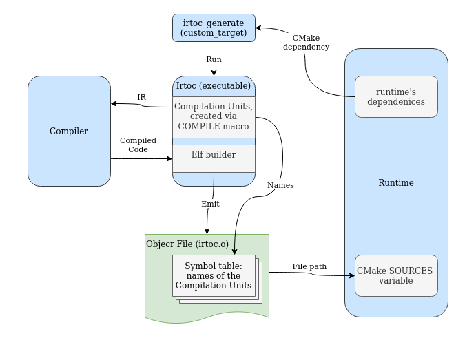

# Irtoc tool

**Irtoc**(Ir-To-Code) tool is aimed to compile a manually created IR (intermediate representation) to the target code.

Building flow:



## Irtoc language

> WARNING: this part is still under development. Thus, some things may be changed in the final implementation.

Irtoc DSL is a wrapper above the `IrConstructor`. It reads compiler's `instructions.yaml` file to get information about instructions. As output it generates c++ code, that uses `IrConstructor` to build IR.

Each opcode in the IR instructions has corresponding token in the irtoc lang. For example, IR instruction `Add`:
```
  - opcode: Add
    base: BinaryOperation
    signature: [d-number, number, number]
    flags: [commutative, acc_write, acc_read, ifcvt]
    description: Add two inputs.
```
has keyword with the same name `Add` and with same signature:
```
var = Add(input1, input2)
```

All property setters that IrConstructor provides (`i64`, `bool`, `Pc`, `CC`, etc) are
available in Irtoc lang. They can be set in the similar way as in the IrConstructor:
```
var = Add(input1, input2).i64.CC(:CC_GE).pc(123)
```
### Pseudo instructions
Pseudo instructions are not a real IR instructions in terms of compiler, those instructions are needed only as helpers
for Irtoc. For example, for creating a control flow: Label, Else, While.

Pseudo instructions are described like regular instructions in the `instructions.yaml` file, but in the separate section `pseudo_instructions`.

### Data flow

In last example variable `var` holds the newly created instruction `Add` and it can be input for the further instructions.
Thus, dataflow is constructing like in other general-purpose language: assign variable - use variable:
```
var = Add(input1, input2).i64.CC(:CC_GE).pc(123)
Return(var).i64
```
Also it is possible to omit variables and create instruction in-place:
```
Return(Add(input1, input2).i64.CC(:CC_GE).pc(123)).i64
```

### Control flow

Irtoc uses instruction `If` and pseudo instruction `Else` to express conditional execution.

For example, add 1 to the biggest value:
```
function TestIncMaxValue(params: {a: i64, b: i64}) {
    If(a, b).CC(:CC_GE) {
        v1 = Add(a, 1).i64
    } Else {
        v2 = Add(b, 1).i64
    }
    phi = Phi(v1, v2)
    Return(phi).i64
}
```

After automatic phi insertion will be implemented:
```
function TestIncMaxValue(params: {a: i64, b: i64}) {
    If(a, b).CC(:CC_GE) {
        v = Add(a, 1).i64
    } Else {
        v = Add(b, 1).i64
    }
    Return(v).i64
}
```

`While` statement has the following semantic:
```
function SumSequence(params: {start: u64, end: u64}) {
    res = 0
    While (start, end).cc(ne) {
        res = Add(res, start)
        start = Add(start, 1)
    }

    Return.u32(res)
}
```

Using labels:

```
function SumSequence(params: {start: u64, end: u64}) {
    res = 0

    Label(head)
    If (start, end).cc(ne) {
        Goto(exit)
    }

    res = Add(res, start)
    start = Add(start, 1)
    Goto(head)

    Label(exit)

    Return.u32(res)
}
```

## Dedicated registers

Sometimes there will be need to specify target register for the input parameter or other entities within a script.

For such needs, each function takes registers map as an input:
```
regmap_tls = {ARM64: {tr: 28},
              ARM32: {tr: 12},
              X86_64: {tr: 15}}
function CallEntrypoint(params: {offset: u64, tls: ptr(tr)}, regmap=regmap_tls) {
    entry = Load(tr, offset)
    Call(entry)
}
```
It will be transformed to the folloiwng code for Arm64 target:
```
COMPILE(CallEntrypoint) {
    GRAPH(GetGraph()) {
        PARAMETER(0, 1).u64();
        PARAMETER(1, 1).ptr().DstReg(28); // for x86 will be `.DstReg(15)`
        ...
    }
}
```
So, 28 register will be reserved for the life interval started by the second parameter.
